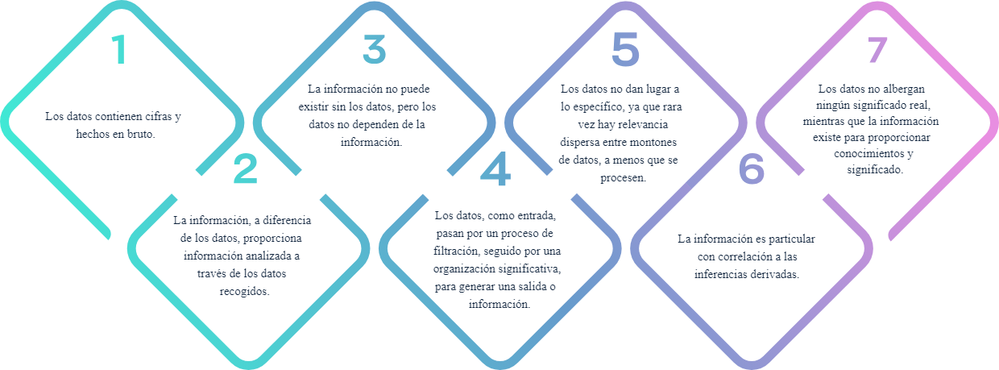

# Análisis y clasificación de la información

El concepto de estudio de analítica de datos aplica para realizar diferentes funciones cotidianas en el proceso logístico,
lo que facilita un mayor dominio del ecosistema de datos y su respectivo análisis para interpretar, comunicar y tomar
decisiones estratégicamente en la empresa.

## Introducción

Con el paso del tiempo, el ser humano ha visto la necesidad de desarrollar diferentes mecanismos de almacenamiento, debido
al crecimiento de la cantidad de datos originados y a los diferentes desafíos que emergen de la administración de la
información.

Desde la antigüedad, la información se almacenaba. Los sumerios usaban tablillas de arcilla para este proceso o actividad,
ubicándose este como un primer sistema de almacenamiento.

En la era digital, el almacenamiento de datos nace hacia mediados del siglo XX, con la invención de los computadores y las
unidades de discos duros (HDD).

Estos sistemas para datos digitales han cambiado nuestra forma de guardar, tomando en cuenta la necesidad de más capacidad
de espacio, rapidez y velocidad en los dispositivos de ingreso y salida para entrar y consultar la información.

De esta manera, a través de la evolución de la tecnología, se han logrado suplir las necesidades requeridas de almacenamiento,
De allí, nos encontramos en una fase de arduo trabajo, donde es más sencillo crear datos que guardarlos y administrarlos,
Para optimizar los beneficios, es necesario establecer una relación de asociación de los procesos que participan en la
logística.

La integración de la analítica de datos se presenta como un enfoque adecuado para aprovechar la forma en que una empresa
que trabaja en esta área es capaz de mejorar la eficiencia y la eficacia de todos sus procesos.

Profundizacion:

[Datos]([https://](https://www.youtube.com/watch?v=bXdteqmjs2o&ab_channel=EcosistemadeRecursosEducativosDigitalesSENA))

- El concepto:

Análisis de datos lo definimos como el proceso de recoger información y luego analizarla para confirmar varias hipótesis,
el análisis de datos también significa contar historias con datos transmitir de forma clara y concisa el estado del mundo
a quienes nos rodean, tambien el análisis de datos es el uso de la información que nos rodea para tomar decisiones.

En nuestro dia a dias el analisis de datos esta presente, desde que nos levantamos, al ver las noticias, en la seccion del
estado del tiempo, transmitira a que temperaturas estaremos y la probabilidad de lluvias o cualquier otra anonalia climatica
o si por el contrario sera un dia claro y despejado, esos datos determinaran que actividades prodremos realizar a la interperie
o si es mejor estar bajo techo.

El análisis de datos no es un concepto abstracto es algo que hacemos de forma más natural pero tiene un nombre técnico y
ahora se paga a la gente para que lo realice como una experiencia mucho mayor o grandiosa

- El uso:

Los usos del analisis de datos incian con un problema que requiere una solucion, para ello definimos claramente el problema
y se crean hipotesis para llegar a la solucion del mismo, para probar esto, hay que recoger datos, limpiar datos, analizar
las bases y luego presentarlos a los principales interesados.

- El para que:

el para que, siempre estamos analizando datos en la vida cotidiana para predecir dónde ha estado alguien, dónde está ahora
mismo y hacia dónde se dirige; estos datos me ayudan a ver más allá y casi a predecir el futuro de cualquier compañía con
la que trabajo, el análisis de datos es el proceso de recolectar, limpiar, analizar, presentar y en última instancia compartir
los datos y los análisis para poder ayudar a comunicar exactamente lo que está pasando en la empresa; lo que está sucediendo
con los datos puede ayudar a tomar mejores decisiones para una gestión organizacional.

podemos concluir que el análisis de datos es un proceso o mejor aún un fenómeno de tomar información recopilada de una
población relevante, tal vez, clientes, audiencia social, proveedores y usar estos datos para tomar decisiones sobre
productos o servicios que queremos ofrecer o mejorar. En los casos de entorno digital en el que nos encontramos actualmente
el buen uso el análisis de datos permitirá a las empresas que logren un camino donde podrán ser más atractivos para los
clientes tomar decisiones en sus procesos brindando beneficios claros reduciendo costos y un desempeño optimizado de todos
sus procesos.

## Análisis de datos

El manejo de los datos, en los últimos años, está revolucionando muchos campos de la empresa, y la analítica logística
es uno de ellos. La naturaleza compleja y dinámica de la logística, junto con la dependencia de muchas partes móviles que
pueden crear cuellos de botella en cualquier punto de la cadena de suministro, hacen de la logística un caso de uso perfecto
para el big data.

El aumento de la cantidad de datos disponibles presenta tanto oportunidades como problemas. En general, disponer de más
datos sobre los clientes (y los clientes potenciales) debería permitir a las empresas adaptar mejor los productos y los
esfuerzos de marketing, con el fin de crear mayor nivel de satisfacción y de repetición del negocio. Las empresas que recogen
una gran cantidad de datos tienen la oportunidad de realizar análisis más profundos y ricos, en beneficio de todas las partes
interesadas.

Por ejemplo, el big data logístico puede utilizarse para optimizar las rutas, racionalizar las funciones de las fábricas
y dar transparencia a toda la cadena de suministro, en beneficio tanto de las empresas como de su logística.

El big data en logística requiere una gran cantidad de fuentes de información de alta calidad para funcionar eficazmente.
¿De dónde van a salir todos esos datos? A continuación, se relaciona una amplia selección de posibles fuentes de datos,
entre las que se incluyen:

- Datos tradicionales de la empresa
- Datos de trafico y meteorologicos
- Diagnostico de vehiculos
- Previsiones finanacieras del negocio
- Datos de respuesta publicitaria
- Datos de patrones de navegacion de sitios web
- Datos de redes sociales

Es claro que hay muchas formas de alimentar los sistemas de datos con la información que necesitan. Todas estas fuentes
de datos y casos de uso potenciales han llevado a afirmar que la tecnología de big data y automatización conducirá a niveles
de optimización antes inimaginables en la fabricación, la logística, el almacenamiento y la entrega de última milla.

Los big data pueden recopilarse a partir de comentarios compartidos públicamente en redes sociales y sitios web, recogidos
voluntariamente en aparatos electrónicos y aplicaciones personales, mediante cuestionarios, compras de productos y registros
electrónicos. La presencia de sensores y otras entradas en los dispositivos inteligentes permite recopilar datos en un
amplio espectro de situaciones y circunstancias. En cualquier caso, parece que el futuro es brillante para las empresas de
logística que estén dispuestas a aprovechar el big data.

*1.1 información:*

La información son datos cotejados para derivar inferencias significativas según su requisito contextual, que se estructura,
procesa y presenta con un significado asignado que mejora la fiabilidad de los datos adquiridos, garantizando que no haya
incertidumbre y que sean pertinentes.

En esencia, la información existe para sistematizar datos relevantes y oportunos para presentar o desarrollar ideas. A
diferencia de los datos, la información es fundamental, ya que procesa los datos a través de la inteligencia intencionada
para interpretar, predecir o explicar.

En el siguiente esquema, se comparte la diferencia entre datos e información:

El conocimiento es una información procesada en la mente de su poseedor. Son informaciones personalizadas, que se recogen
mediante el estudio o las experiencias. El conocimiento también puede verse desde perspectivas diferenciales; de allí, la
información representa un mensaje con significado que se deriva de los datos, que consisten en un conjunto de registros
simples, no filtrados y objetivos.

Se presentan algunos elementos que permiten reconocer los datos, la información y el conocimiento.

    Información refinada, estructurada y evolucionada a partir de datos brutos listos para ser analizados.

    La información requiere ser contextualizada para convertirse en conocimiento.

    La información se refiere a un flujo de mensajes.

    La información son datos pero con contexto.

    La información tiene las cualidades de transmitir y comunicar, impactar en los juicios y en el comportamiento.

La ciencia y la tecnología de la información han ganado potencial en términos de transición tecnológica: desde los servidores
hasta la nube y las bases de datos más inteligentes, los datos se procesan en un abrir y cerrar de ojos. Con la velocidad,
viene la capacidad de procesar datos, incluso con unidades de hardware de bajo coste, como las SSD (unidades de estado
sólido), los HDD (discos duros) y los servicios en la nube. Las organizaciones almacenan ahora montones de datos, con la
esperanza de procesarlos para obtener información que les ayude a tomar decisiones organizativas o a predecir la futura
fiabilidad de sus productos o servicios en el mercado.

Desde la ciencia médica, la educación, la logística, hasta los programas espaciales, por nombrar algunos escenarios, los
datos y la información resuelven problemas de la vida real a una velocidad vertiginosa, con sus diversas aplicaciones. Prácticamente,
no hay límites para sus aplicaciones en las industrias y los beneficios que albergan.

## Soporte de análisis de datos

## Redes de datos

## Procedimiento documental

## Herramientas tecnológicas
