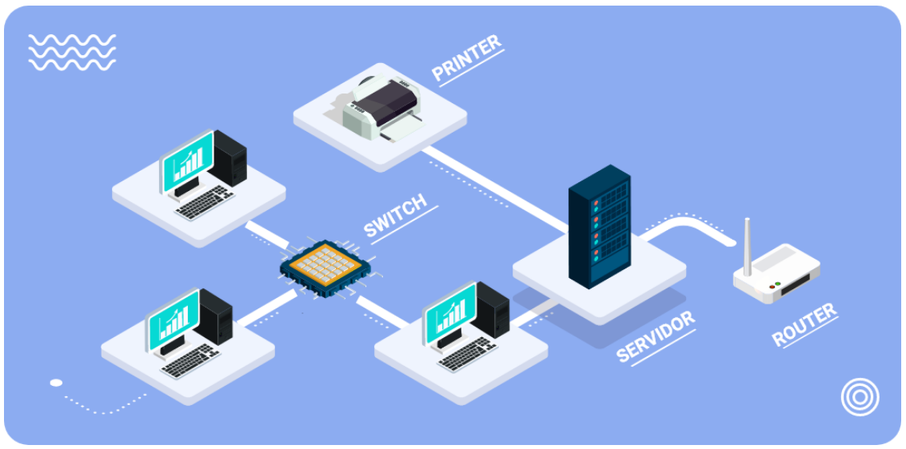

# Análisis y clasificación de la información

El concepto de estudio de analítica de datos aplica para realizar diferentes funciones cotidianas en el proceso logístico,
lo que facilita un mayor dominio del ecosistema de datos y su respectivo análisis para interpretar, comunicar y tomar
decisiones estratégicamente en la empresa.

## Introducción

Con el paso del tiempo, el ser humano ha visto la necesidad de desarrollar diferentes mecanismos de almacenamiento, debido
al crecimiento de la cantidad de datos originados y a los diferentes desafíos que emergen de la administración de la
información.

Desde la antigüedad, la información se almacenaba. Los sumerios usaban tablillas de arcilla para este proceso o actividad,
ubicándose este como un primer sistema de almacenamiento.

En la era digital, el almacenamiento de datos nace hacia mediados del siglo XX, con la invención de los computadores y las
unidades de discos duros (HDD).

Estos sistemas para datos digitales han cambiado nuestra forma de guardar, tomando en cuenta la necesidad de más capacidad
de espacio, rapidez y velocidad en los dispositivos de ingreso y salida para entrar y consultar la información.

De esta manera, a través de la evolución de la tecnología, se han logrado suplir las necesidades requeridas de almacenamiento,
De allí, nos encontramos en una fase de arduo trabajo, donde es más sencillo crear datos que guardarlos y administrarlos,
Para optimizar los beneficios, es necesario establecer una relación de asociación de los procesos que participan en la
logística.

La integración de la analítica de datos se presenta como un enfoque adecuado para aprovechar la forma en que una empresa
que trabaja en esta área es capaz de mejorar la eficiencia y la eficacia de todos sus procesos.

Profundizacion:

[Datos]([https://](https://www.youtube.com/watch?v=bXdteqmjs2o&ab_channel=EcosistemadeRecursosEducativosDigitalesSENA))

- El concepto:

Análisis de datos lo definimos como el proceso de recoger información y luego analizarla para confirmar varias hipótesis,
el análisis de datos también significa contar historias con datos transmitir de forma clara y concisa el estado del mundo
a quienes nos rodean, tambien el análisis de datos es el uso de la información que nos rodea para tomar decisiones.

En nuestro dia a dias el analisis de datos esta presente, desde que nos levantamos, al ver las noticias, en la seccion del
estado del tiempo, transmitira a que temperaturas estaremos y la probabilidad de lluvias o cualquier otra anonalia climatica
o si por el contrario sera un dia claro y despejado, esos datos determinaran que actividades prodremos realizar a la interperie
o si es mejor estar bajo techo.

El análisis de datos no es un concepto abstracto es algo que hacemos de forma más natural pero tiene un nombre técnico y
ahora se paga a la gente para que lo realice como una experiencia mucho mayor o grandiosa

- El uso:

Los usos del analisis de datos incian con un problema que requiere una solucion, para ello definimos claramente el problema
y se crean hipotesis para llegar a la solucion del mismo, para probar esto, hay que recoger datos, limpiar datos, analizar
las bases y luego presentarlos a los principales interesados.

- El para que:

el para que, siempre estamos analizando datos en la vida cotidiana para predecir dónde ha estado alguien, dónde está ahora
mismo y hacia dónde se dirige; estos datos me ayudan a ver más allá y casi a predecir el futuro de cualquier compañía con
la que trabajo, el análisis de datos es el proceso de recolectar, limpiar, analizar, presentar y en última instancia compartir
los datos y los análisis para poder ayudar a comunicar exactamente lo que está pasando en la empresa; lo que está sucediendo
con los datos puede ayudar a tomar mejores decisiones para una gestión organizacional.

podemos concluir que el análisis de datos es un proceso o mejor aún un fenómeno de tomar información recopilada de una
población relevante, tal vez, clientes, audiencia social, proveedores y usar estos datos para tomar decisiones sobre
productos o servicios que queremos ofrecer o mejorar. En los casos de entorno digital en el que nos encontramos actualmente
el buen uso el análisis de datos permitirá a las empresas que logren un camino donde podrán ser más atractivos para los
clientes tomar decisiones en sus procesos brindando beneficios claros reduciendo costos y un desempeño optimizado de todos
sus procesos.

## Análisis de datos

El manejo de los datos, en los últimos años, está revolucionando muchos campos de la empresa, y la analítica logística
es uno de ellos. La naturaleza compleja y dinámica de la logística, junto con la dependencia de muchas partes móviles que
pueden crear cuellos de botella en cualquier punto de la cadena de suministro, hacen de la logística un caso de uso perfecto
para el big data.

El aumento de la cantidad de datos disponibles presenta tanto oportunidades como problemas. En general, disponer de más
datos sobre los clientes (y los clientes potenciales) debería permitir a las empresas adaptar mejor los productos y los
esfuerzos de marketing, con el fin de crear mayor nivel de satisfacción y de repetición del negocio. Las empresas que recogen
una gran cantidad de datos tienen la oportunidad de realizar análisis más profundos y ricos, en beneficio de todas las partes
interesadas.

Por ejemplo, el big data logístico puede utilizarse para optimizar las rutas, racionalizar las funciones de las fábricas
y dar transparencia a toda la cadena de suministro, en beneficio tanto de las empresas como de su logística.

El big data en logística requiere una gran cantidad de fuentes de información de alta calidad para funcionar eficazmente.
¿De dónde van a salir todos esos datos? A continuación, se relaciona una amplia selección de posibles fuentes de datos,
entre las que se incluyen:

- Datos tradicionales de la empresa
- Datos de trafico y meteorologicos
- Diagnostico de vehiculos
- Previsiones finanacieras del negocio
- Datos de respuesta publicitaria
- Datos de patrones de navegacion de sitios web
- Datos de redes sociales

Es claro que hay muchas formas de alimentar los sistemas de datos con la información que necesitan. Todas estas fuentes
de datos y casos de uso potenciales han llevado a afirmar que la tecnología de big data y automatización conducirá a niveles
de optimización antes inimaginables en la fabricación, la logística, el almacenamiento y la entrega de última milla.

Los big data pueden recopilarse a partir de comentarios compartidos públicamente en redes sociales y sitios web, recogidos
voluntariamente en aparatos electrónicos y aplicaciones personales, mediante cuestionarios, compras de productos y registros
electrónicos. La presencia de sensores y otras entradas en los dispositivos inteligentes permite recopilar datos en un
amplio espectro de situaciones y circunstancias. En cualquier caso, parece que el futuro es brillante para las empresas de
logística que estén dispuestas a aprovechar el big data.

*1.1 información:*

La información son datos cotejados para derivar inferencias significativas según su requisito contextual, que se estructura,
procesa y presenta con un significado asignado que mejora la fiabilidad de los datos adquiridos, garantizando que no haya
incertidumbre y que sean pertinentes.

En esencia, la información existe para sistematizar datos relevantes y oportunos para presentar o desarrollar ideas. A
diferencia de los datos, la información es fundamental, ya que procesa los datos a través de la inteligencia intencionada
para interpretar, predecir o explicar.

En el siguiente esquema, se comparte la diferencia entre datos e información:

El conocimiento es una información procesada en la mente de su poseedor. Son informaciones personalizadas, que se recogen
mediante el estudio o las experiencias. El conocimiento también puede verse desde perspectivas diferenciales; de allí, la
información representa un mensaje con significado que se deriva de los datos, que consisten en un conjunto de registros
simples, no filtrados y objetivos.

Se presentan algunos elementos que permiten reconocer los datos, la información y el conocimiento.

    Información refinada, estructurada y evolucionada a partir de datos brutos listos para ser analizados.

    La información requiere ser contextualizada para convertirse en conocimiento.

    La información se refiere a un flujo de mensajes.

    La información son datos pero con contexto.

    La información tiene las cualidades de transmitir y comunicar, impactar en los juicios y en el comportamiento.

La ciencia y la tecnología de la información han ganado potencial en términos de transición tecnológica: desde los servidores
hasta la nube y las bases de datos más inteligentes, los datos se procesan en un abrir y cerrar de ojos. Con la velocidad,
viene la capacidad de procesar datos, incluso con unidades de hardware de bajo coste, como las SSD (unidades de estado
sólido), los HDD (discos duros) y los servicios en la nube. Las organizaciones almacenan ahora montones de datos, con la
esperanza de procesarlos para obtener información que les ayude a tomar decisiones organizativas o a predecir la futura
fiabilidad de sus productos o servicios en el mercado.

Desde la ciencia médica, la educación, la logística, hasta los programas espaciales, por nombrar algunos escenarios, los
datos y la información resuelven problemas de la vida real a una velocidad vertiginosa, con sus diversas aplicaciones. Prácticamente,
no hay límites para sus aplicaciones en las industrias y los beneficios que albergan.

*1.2 Registro de datos:*

El concepto de registro de datos se define como el grupo de información, con cierta correlación, estructurado en una tabla
conformada por campos, como columnas y filas; el objetivo general de este es poner por escrito y asegurar la conservación
de los datos recogidos para estudios específicos a desarrollar e implementar dentro de la empresa. Cada estudio o necesidad
determina los tipos de datos que deben recogerse en función de los objetivos y los recursos disponibles para el mismo.

Los tipos de datos utilizados habitualmente en los estudios suelen estar relacionados con la actividad económica de la
empresa. Sin embargo, sea cual sea la naturaleza de los tipos de datos, es necesario disponer de formularios o cuestionarios
adecuados para registrar la información que se va a recoger. A menudo, es conveniente preparar estos formularios o cuestionarios
por disciplina o tipo de datos. Es preferible el uso de formularios o cuestionarios precodificados, que permitan el registro
directo de los datos, ya que, con una formación adecuada, su uso suele dar lugar a menos errores. Además, se utilizará un
solo protocolo o conjunto de formularios para recoger y codificar la información que se registrará en el campo para cada
unidad de estudio (por ejemplo, familia o individuo).

El objetivo de esta etapa es elaborar todos los formularios y/o cuestionarios necesarios en sus versiones definitivas,
tal y como se utilizarán sobre el registro de la empresa. Estos formularios y cuestionarios deben ir acompañados de un
conjunto de instrucciones detalladas, recogidas explícitamente en un manual de codificación.

Los formularios y cuestionarios contienen la información necesaria tanto para el desarrollador como para el personal de
procesamiento de datos, y generalmente constan de dos partes:

Un encabezado

    El encabezamiento de los formularios o cuestionarios incluye la información necesaria, principalmente, para preparar
    los archivos de datos adecuados de acuerdo con los objetivos del estudio, definidos por el investigador responsable.

    Puede incluir información para que el investigador pueda recuperar a los sujetos, ya sea para realizar nuevas entrevistas
    o para comprobar las grabaciones originales.

    Evidentemente, el tipo de ítems de esta parte del formulario o cuestionario varía según la naturaleza del estudio, pero
    generalmente debe incluir información del tipo especificado.

Un cuerpo

    Se hace necesario solicitar los datos y la información real que se requiera para satisfacer los objetivos del estudio.

    En el cuerpo del formulario, pueden utilizarse tantos campos y dígitos como sean necesarios para completar el registro.

    Sin embargo, siempre es aconsejable consultar con el personal que se encargará del procesamiento y análisis de los datos
    para evitar problemas relacionados con la gestión de estos.

## Soporte de análisis de datos

El área de soporte técnico es la encargada de ofrecer ayuda a clientes cuando presentan inconvenientes al usar un producto
o servicio, tal como un software o hardware en un equipo de cómputo, un servidor de Internet o un dispositivo.

Con el creciente uso de la tecnología en los tiempos modernos, hay una necesidad cada vez mayor de proporcionar soporte
técnico. Muchas organizaciones ubican sus departamentos de soporte técnico o centros de llamadas en países o regiones con
costes más bajos. Dell fue una de las primeras empresas en externalizar sus departamentos de soporte técnico y atención
al cliente a la India, en 2004. También han aumentado las empresas especializadas en ofrecer soporte técnico a otras
organizaciones.

Para las empresas que necesitan proporcionar soporte técnico, la externalización les permite mantener una alta disponibilidad
del servicio. Esta necesidad puede ser el resultado de picos en el volumen de llamadas durante el día, periodos de gran
actividad debido a la introducción de nuevos productos o paquetes de servicios de mantenimiento, o el requisito de proporcionar
a los clientes un alto nivel de servicio a un bajo costo para la empresa.

Los tipos de soporte de datos más conocidos son:

Vía telefónica: Es la alternativa más ágil de solucionar cualquier requerimiento que presente el cliente.

Visita en presencia física: Se generan algunos problemas que no pueden solucionarse a distancia. Por lo tanto, existe la
alternativa de que un experto técnico del área se desplace al domicilio del cliente o al sitio donde esté ubicado el sistema
objeto de soporte.

Correo o texto a través de un dispositivo o vía remota: Con este sistema, el cliente no deberá estar en espera para contactar
con un técnico, puede resolver su duda en el chat o en el sitio web y hacerlo en el momento que presente la necesidad.

2.1 Características del soporte

El soporte técnico se suele subdividir en niveles, para poder atender mejor a una empresa o a una base de clientes. El
número de niveles que una empresa utiliza para organizar su grupo de soporte técnico depende de las necesidades de la empresa,
en cuanto a su capacidad para atender suficientemente a sus clientes o usuarios.

La razón para proporcionar un sistema de soporte de varios niveles, en lugar de un grupo de soporte general, es proporcionar
el mejor servicio posible y de la manera más eficiente posible; el éxito de la estructura organizativa depende de que los
técnicos comprendan su nivel de responsabilidad, sus compromisos de tiempo de respuesta al cliente, cuándo escalar adecuadamente
un problema y a qué nivel.

Una estructura de soporte común gira en torno a un sistema de soporte técnico de tres niveles, como se comparte en la siguiente
imagen:

Cuando se produce una incidencia relacionada con Tecnologías de la Información, se sigue un proceso que comienza con el
acceso de la incidencia, que lleva a un registro y categorización de la misma. Después, se hace un diagnóstico, que conlleva
la solución y cierre de la incidencia.

Una vez que se genera una incidencia, se traslada a un técnico, de acuerdo con el tipo o nivel de incidencia en el caso
concreto, y se asigna de manera directa; dicho técnico diagnostica el problema, identificando la causa que lo genera, y
trata de resolverlo. En caso de conseguirlo, se cierra la incidencia como solucionada. Si el problema no se puede solucionar,
se pasa al siguiente grado de soporte, para que se encargue de esa incidencia, contando con la información aportada por
el grado inferior.

2.2. Almacenamiento de la información

El almacenamiento de datos se refiere al uso de medios de grabación para conservar los datos, mediante ordenadores u otros
dispositivos. Las formas más frecuentes de almacenamiento de datos son el almacenamiento de archivos, el almacenamiento
de bloques y el almacenamiento de objetos, siendo cada uno de ellos ideal para diferentes fines.

    Almacenamiento en carpetas: Los datos que son de construcción básica se almacenan en archivos y carpetas. Por lo general,
    se encuentran en los discos duros y significa que los archivos tienen exactamente el mismo aspecto del disco duro para
    el usuario.

    Almacenamiento en bloques: Los datos se almacenan en bloques de tamaño uniforme. Aunque es más caro, complejo y menos
    escalable, el almacenamiento en bloques es ideal para los datos a los que hay que acceder y editar con frecuencia.

    Almacenamiento de objetos: Los datos se almacenan como objetos, con metadatos e identificadores únicos. Aunque generalmente
    es menos costoso almacenar los datos de esta manera, el almacenamiento de objetos solo es ideal para los datos que no
    necesitan ser editados.

En términos sencillos, los ordenadores modernos, o terminales, se conectan a dispositivos de almacenamiento directamente
o a través de una red. Los usuarios dan instrucciones a los ordenadores para que accedan a los datos desde estos dispositivos
de almacenamiento y los almacenen en ellos. Sin embargo, en un nivel fundamental, hay dos bases para el almacenamiento de
datos: la forma que adoptan los datos y los dispositivos en los que se registran y almacenan.

Las tecnologías utilizadas para almacenamiento están en permanente cambio; la mejor elección es la que obedezca a las
necesidades, además de ser productiva, con posibilidades de proyecciones de ampliación y escalabilidad.

## Redes de datos

Las redes de datos son sistemas diseñados para transferir datos entre dos o más puntos de acceso, mediante el uso de controles
de sistema, líneas de transmisión y conmutación de datos. Lo que hace que una red de datos sea única con respecto a otros
tipos de redes es que está configurada para transmitir únicamente datos.

¿Cómo funciona? En general, las redes de datos se definen por su capacidad de transmitir señales mediante la conmutación
de paquetes. El mensaje de datos se descompone en bits discretos, llamados paquetes, y estos paquetes se envían por una
red digital que utiliza una ruta óptima para minimizar el retraso en la velocidad de la red de datos. Una vez transmitidos,
los paquetes de datos se vuelven a ensamblar cuando llegan al destino.

El uso de las redes de datos tiene una amplia gama de ventajas que vale la pena comprender antes de empezar a adoptar este
enfoque. Para empezar, es útil conocer las tres principales:

    Comunicación: Tal vez la mayor ventaja de utilizar una red de datos es su capacidad para permitir una comunicación rápida
    y fluida. Los ordenadores conectados a través de una red de datos pueden comunicarse entre sí y transferir archivos
    sin necesidad de medios físicos de transferencia.

    Colaboración: Una red de datos puede permitir la colaboración sin fisuras entre dos individuos o equipos separados
    geográficamente. Varios usuarios (conectados a través de una red de datos) pueden trabajar simultáneamente en el mismo
    proyecto o documento, a distancia.

    Compartir recursos: Una red de datos no requiere una conexión física para compartir información. Esto significa que
    recursos como Internet, medios de almacenamiento e impresoras pueden ser compartidos entre dos o más nodos.

Finalmente, las redes de datos son procesos de comunicación que están conectados entre sí por equipos físicos que envían
y reciben impulsos u ondas para el transporte de datos, con el fin de distribuir información y ofrecer servicios.

3.1 Características de redes de datos

Una red de datos se compone de varias partes clave, como los terminales de datos (por ejemplo, ordenadores personales),
el cableado de acceso y los nodos de distribución de datos (por ejemplo, enrutadores y conmutadores), adaptadores de red,
cableado de acceso y nodos de distribución de datos (por ejemplo, enrutadores, brouters y switches). Los sistemas de
gestión/control de la red se utilizan para configurar, supervisar, coordinar y controlar los elementos de la red.

La comunicación de datos consiste en la transmisión de mensajes digitales entre dispositivos como ordenadores, teléfonos
inteligentes, dispositivos móviles, radios y otros. La forma en que se comunican y fluyen los datos en las redes puede
clasificarse en comunicación "símplex" o "dúplex". Para ampliar lo que representa cada una de ellas, ingrese a las siguientes
pestañas.

    Comunicación símplex

Los datos solo fluyen en una dirección: del emisor al receptor. Sin embargo, este flujo se convierte en bidireccional
cuando se trata de una comunicación dúplex, lo que significa que los datos pueden fluir de ida y vuelta entre el emisor
y el receptor.

    Comunicación dúplex

También puede funcionar en modo full-duplex o half-duplex. En el modo full-duplex, tanto el emisor como el receptor trabajan
simultáneamente. En el modo half-duplex, solo uno puede funcionar a la vez.

Los avances e innovaciones en la tecnología de las redes de datos han hecho evolucionar continuamente la forma de transmitir
y recibir datos. Las redes de datos actuales son una verdadera hazaña de ingenio: van desde simples conexiones individuales
hasta sistemas increíblemente complejos de enrutadores, conmutadores y concentradores de red.

3.2 Tipos y usos de redes de datos

Las redes se configuran con el objeto de transmitir datos de un sistema a otro o de contar con recursos en común, como
servidores, bases de datos o impresoras. En función del tamaño y del alcance de la red de computadoras, se puede demostrar
una diferenciación entre distintas magnitudes de red.

A continuación, se describen los tipos de redes más relevantes que se encuentran y sus usos:

PAN (red de área personal) - Es un modelo de red de comunicación diseñado para intercambio de datos con tecnología moderna,
principalmente, para portátiles, tabletas, equipos de cómputo, impresoras, celulares, con el requisito de estar cerca al
punto de conexión o acceso.

LAN (red de área local) - Puede llegar hasta un radio de 1 KM. Se trata de un grupo de ordenadores y dispositivos asociados,
que comparten una línea de comunicaciones común o un enlace inalámbrico con un servidor. Normalmente, una LAN engloba
ordenadores y periféricos conectados a un servidor dentro de una zona geográfica definida, como una oficina o un establecimiento
comercial.

WAN (red de área amplia) - Sin límite. Es una red que existe en un área geográfica a gran escala. Una WAN conecta diferentes
redes más pequeñas, incluidas las redes de área local (LAN) y las redes de área metropolitana (MAN). Esto garantiza que
los ordenadores y usuarios de un lugar puedan comunicarse con los de otros lugares. La implementación de la WAN puede hacerse
con la ayuda del sistema público de transmisión o de una red privada.

SAN (Red de área de almacenamiento) - Es la mejor opción, ofrece gran velocidad y rendimiento. Está compuesta por dispositivos,
hosts y conmutadores de almacenamiento, que son conectados a través de distintos protocolos. La disponibilidad de este
tipo de red es casi total, dado que los datos que almacena en bloque hacen que se entreguen los recursos de manera eficaz.

MAN (red de área metropolitana) - Es una red informática que interconecta a los usuarios con los recursos informáticos de
un área geográfica o región mayor que la que cubre, incluso una gran red de área local (LAN), pero menor que el área que
cubre una red de área amplia (WAN). El término se aplica a la interconexión de las redes de una ciudad en una única red
más grande (que luego puede ofrecer también una conexión eficaz a una red de área amplia). También se utiliza para referirse
a la interconexión de varias redes de área local mediante puentes con líneas troncales. Este último uso también se denomina
a veces red de campus.

El empalme físico en el que se fundamentan dichos tipos de redes puede manifestarse mediante cables o implementarse con
tecnología inalámbrica. Comúnmente, las redes físicas componen la base para algunas redes lógicas de comunicación, denominadas
Virtual Private Networks (VPN). Se usan para la transmisión de datos, a través de medios como la fibra óptica, y se vinculan
de manera lógica a diversos tipos de redes virtuales mediante un programa o software.

Cada uno de los diferentes tipos de redes está diseñado para ámbitos de aplicación particulares, se basan en técnicas y
estándares propios y plantean ventajas y restricciones variadas.

## Procedimiento documental

La gestión de documentos es el proceso de manejar los documentos de tal manera que la información pueda ser creada, compartida,
organizada y almacenada, de manera eficiente y apropiada. Por ello, aprender a crear un sistema de gestión de documentos
es fundamental para las empresas.

Muchas empresas manejan información de alto riesgo, que debe mantenerse segura y privada, o a la que se debe acceder
rápidamente. En estos casos, un sistema de gestión de documentos que funcione bien es esencial. Pero incluso si su negocio
es de naturaleza más informal, sigue siendo importante mantener registros adecuados para la contabilidad y en aras de la
eficiencia.

En la actualidad, la mayoría de las empresas trabajan cómodamente con documentos digitales y utilizan programas con funciones
de almacenamiento y gestión. No faltan programas de gestión de documentos generales y específicos del sector ni aplicaciones
diseñadas específicamente para mejorar la gestión de los archivos electrónicos de su empresa.

Por ejemplo, es posible que los hoteles sigan teniendo un registro tipo libro en el momento del check-in y que sigan pidiendo
una firma en una ficha de tarjeta de crédito en papel.

Las opciones de pago como pagos seguros en línea PSE y transferencia se utilizan cada vez más en el sector de producción
y de servicios, eliminando también la necesidad de llevar la contabilidad en papel. Sin embargo, muchas empresas tienen
que lidiar con una mezcla de datos anticuados en papel y archivos electrónicos, y, en algunos casos, la proporción de datos
en papel es mucho mayor.

Una solución al problema de un entorno de datos mixtos sería utilizar un sistema de digitalización de documentos para
convertir todos los documentos de su empresa en archivos electrónicos. Dependiendo del tipo de datos y documentos con los
que se trabaje, esto podría ser un proceso relativamente sencillo o podría implicar cierta creatividad y enfoques especializados.

Por ejemplo, un almacén a pequeña escala, que gestiona recibos e inventarios, puede convertir los documentos en papel en
hojas de cálculo digitales, con algo de trabajo adicional de introducción de datos. En cambio, un consultorio odontológico,
que mantiene registros de la salud de los pacientes, la facturación, las radiografías, etc., probablemente necesitará un
método más sólido para convertir sus numerosos archivos en papel a formatos digitales, como la contratación de un servicio
de escaneo de documentos apropiado para la empresa o la compra de un software de escaneo capaz de transferir imágenes de
alta resolución.

4.1. Proceso documental

Tanto si se trabaja con un entorno exclusivamente digital como en un entorno híbrido, con documentos digitales y en papel,
la creación de un sistema de gestión de documentos implica tres pasos:

1. Crear un plan de gestión de documentos

    Facturas, cartas de recordatorio de pago, folletos de ventas, correo electrónico, balances, hojas de cálculo, informes...
    Todas las empresas crean una gran variedad de documentos en el transcurso de su actividad y de su seguimiento. Y, para
    mantener las cosas organizadas, todas las empresas necesitan establecer reglas para crear documentos.

    ¿Existen plantillas internas para algunos de sus documentos empresariales, como cartas o facturas?
    ¿Dónde se encuentran?
    ¿Existe una guía de estilo interna que deba seguirse?
    ¿Deben fecharse o sellarse los nuevos documentos?
    ¿Qué procedimientos deben seguirse para compartir o revisar los documentos?

    Para algunas pequeñas empresas, los únicos puntos importantes serán dónde se encuentran las plantillas de los distintos
    documentos empresariales y cómo utilizarlas. Pero si la creación de documentos dentro de su empresa implica que diferentes
    personas colaboren en ellos, los revisen o los actualicen, tendrá que dedicar algún tiempo a decidir cómo deben hacerse
    estos elementos, para garantizar la eficiencia y la coherencia.

    TIP: Google Docs es un estándar del sector para los proyectos de colaboración, ya que ofrece varias opciones para controlar
    los permisos, ver las ediciones y compartir un mismo documento entre varias personas, con controles de seguridad.

2. Poner en marcha el plan de gestión documental.

    Una vez que haya creado su plan de gestión de documentos, respondiendo a las preguntas anteriores, estará listo para
    ponerlo en práctica. Asegúrese de que todo el personal conoce los detalles del sistema de gestión de documentos de su
    empresa y de que todo el mundo sigue los procedimientos adecuados a la hora de crear, almacenar y recuperar documentos.

    También tendrá que asegurarse de que todas las personas que acceden a los documentos y los utilizan dentro de su
    organización sigan el procedimiento de nombrar y almacenar los documentos de forma adecuada.

3. Realizar un seguimiento.

    Compruebe periódicamente que determinados archivos pueden encontrarse fácilmente y evite que se archiven de forma
    incorrecta. Incluso, un descuido ocasional puede echar a perder todo el sistema.

    Por último, un proceso documental en un sistema de administración gana interés una vez que, al implementarse una
    herramienta tecnológica usada en procesos logísticos, como Enterprise Resource Planning (planificación de recursos
    empresariales, ERP), posibilita vincular los datos y registros con documentos, perfeccionando la estabilidad de ingreso,
    y desde luego, con la probabilidad de su uso de manera remota, en tiempo real, sobre toda su información y en cualquier
    instante.

## Herramientas tecnológicas

Según una definición global, una herramienta tecnológica es cualquier "software" o "hardware" que ayuda a realizar bien
una tarea, entendiéndose por "realizar bien" que se obtenga los resultado esperados, con ahorro de tiempo y ahorro en
recursos personales y económicos.

La implementación de herramientas tecnológicas en las organizaciones puede contribuir a incrementar la productividad de
sus negocios, perfeccionando la efectividad de sus procesos y ubicando la compañía en un estado de innovación permanente,
capaz de ajustarse a las necesidades de los clientes y posicionarse en un mercado cada vez más amplio y competitivo. Para
lograr una transformación digital y aceptación positiva de la nueva situación, los directivos tienen que estar expectantes
de los adelantos tecnológicos que ofrece el mercado.

Hay muchas opciones de tecnología, herramientas y plataformas que ayudarán a hacer crecer las empresas. Una vez se identifique
lo que se quiere lograr, se debe tener en cuenta cuál es la mejor opción para su implementación .

5.1 Características de las herramientas tecnológicas

A continuacion, se describen las principales características de las herramientas usadas en el entorno empresarial:

*ERP:*

    la planificación de recursos empresariales es un proceso utilizado por las empresas para gestionar e integrar las
    partes importantes de sus negocios. Muchas aplicaciones de software ERP son importantes para las empresas, porque les
    ayudan a implementar la planificación de recursos integrando todos los procesos necesarios para dirigir sus empresas con
    un único sistema. Un sistema de software ERP también puede integrar la planificación, el inventario de compras, las ventas,
    el marketing, las finanzas, los recursos humanos, entre otros.

*CRM:*

    se puede traducir al español como Gestión de las Relaciones con los Clientes y se refiere a todas las estrategias,
    técnicas, herramientas y tecnologías utilizadas por las empresas para desarrollar, retener y adquirir clientes. Este
    software garantiza que cada paso de la interacción con los consumidores se desarrolle de forma fluida y eficaz, para
    aumentar los beneficios globales. El software recopila datos de los clientes, procedentes de múltiples canales. Por
    lo tanto, el CRM almacena información detallada sobre el historial general de compras, información personal e incluso
    patrones de comportamiento de compra.

*Herramientas BI:*

    la inteligencia empresarial se refiere a la infraestructura técnica y de procedimiento que recoge, almacena y analiza
    los datos producidos por las actividades de una empresa. BI es un término amplio, que engloba la extracción de datos,
    el análisis de procesos, la evaluación comparativa del rendimiento y el análisis descriptivo. La BI analiza todos los
    datos generados por una empresa y presenta informes fáciles de digerir, medidas de rendimiento y tendencias que informan
    las decisiones de gestión.

*SGA:*

    un Sistema de Gestión de Almacenes ofrece un conjunto de funciones y servicios que abordan un conjunto completo de
    operaciones de almacén. Aunque cada SGA puede proporcionar diferentes servicios de nivel secundario, las características
    principales de un SGA se centran en la gestión del inventario. Un SGA típico puede ofrecer funciones como la gestión
    de los registros de inventario, los detalles de los envíos de inventario, la ubicación de las existencias dentro del
    almacén y la gestión de la capacidad general del almacén. El SGA suele formar parte de una solución de software de
    planificación de recursos empresariales (ERP), pero también puede ser una aplicación independiente. Además, un SGA
    suele integrarse directamente con otros sistemas de información, como el sistema de gestión de la cadena de suministro,
    el sistema de información de producción/fabricación y los sistemas de información de ventas.

*La facturación electrónica:*

    o el pago y la presentación de facturas electrónicas, es cuando un vendedor, una empresa, una organización o un grupo
    envía sus cuentas o facturas a través de Internet, y los clientes pagan las facturas electrónicamente. Esto sustituye
    el método tradicional, en el que las facturas se enviaban en papel y los pagos se hacían por medios manuales, como el
    envío de cheques.

    La facturación electrónica tiene una serie de ventajas, como la rapidez en la presentación de las facturas y la reducción
    de los costes de manipulación de los documentos en papel. Sin embargo, para aprovechar al máximo las ventajas de la
    facturación electrónica, tanto el vendedor como el comprador deben disponer de sistemas informáticos capaces de gestionar
    la facturación electrónica y tener acceso a instituciones financieras que puedan realizar pagos electrónicos.

*Una aplicación móvil, más comúnmente conocida como app:*

    es un tipo de software de aplicación diseñado para ejecutarse en un dispositivo móvil, como un smartphone o una
    ableta. Las aplicaciones móviles suelen servir para ofrecer a los usuarios servicios similares a los de los ordenadores,
    Las apps suelen ser pequeñas unidades de software individuales, con funciones limitadas. Este uso del software de
    aplicaciones fue popularizado originalmente por Apple Inc. y su App Store, que ofrece miles de aplicaciones para el
    iPhone, el iPad y el iPod Touch.

    Una aplicación móvil también puede ser conocida como app, web app, online app, iPhone app o smartphone app.

    Las aplicaciones móviles se alejan de los sistemas de software integrados que suelen encontrarse en los PC. En su lugar,
    cada app ofrece una funcionalidad limitada y aislada, como un juego, una calculadora o la navegación web móvil. Aunque
    las aplicaciones pueden haber evitado la multitarea debido a los limitados recursos de hardware de los primeros
    dispositivos móviles, su especificidad es ahora parte de su atractivo, porque permite a los consumidores elegir a dedo
    lo que sus dispositivos son capaces de hacer.

*Sistema de geolocalización:*

    es la capacidad de rastrear la ubicación de un dispositivo utilizando el GPS, las torres de telefonía móvil, los puntos
    de acceso WiFi o una combinación de ellos. Dado que los dispositivos son utilizados por individuos, la geolocalización
    utiliza sistemas de posicionamiento para rastrear el paradero de un individuo hasta las coordenadas de latitud y longitud,
    o más, prácticamente una dirección física. Tanto los dispositivos móviles como los de escritorio pueden utilizar la
    geolocalización.
