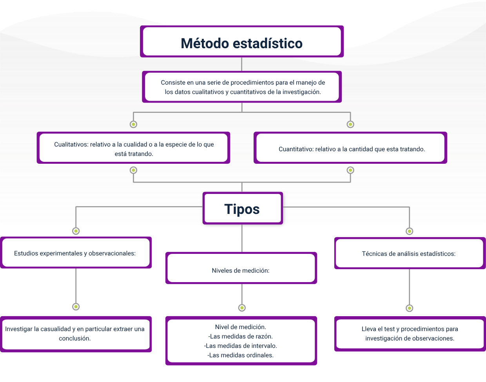
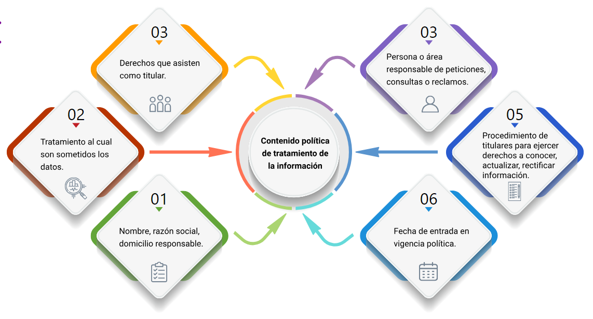

# Administración y normativa de registros de información

## Introducción_seman_2

administración y normativa de registros de información, las empresas utilizan sistemas de información en todos los niveles
de operación para recoger, procesar y almacenar datos; esto lo podemos ver desde el que paga las facturas hasta el que toma
las decisiones de empleo o identificar qué productos se venden mejor, muchas de las empresas se concentran en la búsqueda
de información en los procesos logísticos con el objetivo de lograr una ventaja competitiva frente al mercado.

la idea errónea en los procesos de registro y manejo de información es que se ocupa de la codificación, que representa
algunos de los principios fundamentales del desarrollo, la implementación y el uso de los sistemas de información, sin
embargo, muchos trabajos no requieren como tal un proceso de codificación, por el contrario los sistemas de información
se centran en el análisis de datos, un manejo de estadística confidencialidad de la información, proceso administrativo
en el trabajo del equipo, el liderazgo, la gestión de estrategias para el servicio al cliente y para el negocio como tal.

podemos considerar que la administración registro de información se trata de un campo donde la demanda de personal calificado
se está incrementando día a día y el mercado ofrece diferentes alternativas para el talento humano formado en estas
competencias para su crecimiento laboral y personal podemos considerar que la administración de registros de información
es un campo de alta demanda de personal calificado por lo que el mercado requiere de talento humano formado en estas
competencias

Administración registros de información en la empresa el día de hoy vamos a hablar de la administración de registros de
información en la empresa, extendemos su definición de administración de registro como documento o entidad electrónica o
física de la organización que sirve como prueba de una actividad o transacción realizada por la organización y se debe
observar durante un determinado periodo de tiempo, por ejemplo podemos enumerar, una toma de datos para valorar un trabajo
de realizar un listado de asistencia del personal, alguna capacitación o algún ambiente de clas,e una oferta, una cotización,
un presupuesto, un acta de reunión, un contrato o un informe planeación de administración de registros, en este tema vamos
a describir los pasos de la planeación que deben seguirse para asegurarse de que el sistema de administración de registros
que implemente logre los objetivos de administración de registro dentro de la organización, a continuación describiremos
el proceso de la planeación de la administración en 10 actividades de registro:

    Identificar roles de administración de registros
    Analizar el contenido de la organizacion
    Desarrollar un plan de archivos
    Desarollar programaciones de retencion
    Evaluar y mejorar los procedimientos de administracion de documentos
    Diseñar la solucion de administracion de registros
    Planear como el contenido se convierte em registros
    Planear la integracion de correo electronico
    Planear el cumplimiento del contenido social
    Planear la documentacion y los informes de conformidad

la primera es identificar roles de administración de registros: una administración de registro satisfactoria requiere roles
especializados tales como:

*administrador de registros* siendo la persona encargada del cumplimiento de las directivas.
*especialista en manejo de las tecnologías de la información* para implementar los sistemas de manera eficaz
*una persona administradora del contenido* para identificar dónde se guarda la información de la organización y garantizar
que los equipos sigan los procedimientos, oración y registros.

La segunda es analizar el contenido de la organización: antes de crear un plan de archivos los administradores de registro
y los administradores de contenidos realizan una encuesta o un estudio sobre el uso de documentos en la organización y
determinan qué documentos y qué elementos pueden convertirse en registro.

La tercera, un plan de archivos: una vez analizado el contenido de la organización y determinada las programaciones de
retención de contenido, los planes se describen en qué elementos la empresa reconoce como registros, donde irán almacenados,
describen los periodos de retención y proporcionan información adicional de los criterios para establecer una persona encargada
o responsable de la administración.

La cuarta es, desarrollar programación de retención: para cada tipo de registro determine cuándo se va a dejar de estar
el archivo - o cuánto tiempo debe conservarse después y como debería eliminarse al final, aquí tendremos en cuenta la
normatividad vigente para guardar información.

La quinta es, evaluar y mejorar los procedimientos de administración: asegurarse de que se apliquen las directivas obligatorias
en los repositorios de documentos, un ejemplo seria que el contenido que se utilice correctamente pueda observarse junto
con todos sus registros en el momento que sea requerido por alguna entidad estatal o por la misma empresa para alguna
información

La sexta es, diseñar la solución de administración de registros: aquí se determina si se va a crear un archivo de registros
para administrar los archivos en el contexto o si se usa una combinación de dos o más métodos.

La septima, planear como el contenido se convierte en registros: la administración de registros puede crear flujos de trabajo
personalizados para mover documentos a un archivo de registros, si usa un sistema de administración de documentos externos
puede planear y desarrollar interfaces que muevan el contenido de estos sistemas al archivo de registros, que declaren
un documento como un registro y no muevan el documento.

La octava, planear la integración del correo electrónico: acá determinar si va a administrar registros de correo electrónico
el sistema o si se van a administrar los registros dentro de la propia aplicación del correo electrónico.

La novena, planear el cumplimiento el contenido social: aquí la organización usa medios sociales como blogs sitios wikis
o medios que determine cómo se convertiría este registro a través de qué medio.

La decima, plantear la documentación y los informes de conformidad: para comprobar si la organización realiza los procedimientos
de administración de registros obligatorios y para comunicar estos procedimientos debe documentar los planes y procesos de
administración de registros si la empresa participa en procesos judiciales relacionados con registros es posible que requiera
dar instrucciones de administración especiales para su implementación, en el caso de colombia debemos tener en cuenta las
políticas que hay con el manejo de la confianza y la confidencialidad de la información.

## Estadística descriptiva

La Estadística descriptiva en el ambito de la anilitica de datos:

    Se encarga de recoger, almacenar, ordenar, realizar tablas o gráficos y calcular parámetros básicos sobre el conjunto
    de datos.

    Es junto a la inferencia estadística una de las dos grandes ramas de la estadística.

    Su propio nombre lo indica, trata de describir algo. Pero no describirlo de cualquier forma, sino de manera cuantitativa.

    Responde a preguntas como por ejemplo: ¿cuál es la altura promedio en centímetros de una población?

La estadística descriptiva se utiliza para describir las características básicas de los datos de un estudio; recoge, almacena,
ordena, para la construcción de gráficos y tablas calculando parámetros sencillos del grupo de datos.

Proporciona resúmenes sencillos sobre la muestra y las medidas; junto con un análisis gráfico sencillo, constituyen la base
de prácticamente todos los análisis cuantitativos de datos.

Algunas características de la estadística descriptiva son:

    1. La estadística descriptiva describe, muestra y resume las características básicas de un conjunto de datos encontrados
       en un determinado estudio, presentado en un resumen que describe la muestra de datos y sus medidas. Ayuda a los
       analistas a comprender mejor los datos.
    
    2. La estadística descriptiva representa la muestra de datos disponible y no incluye teorías, inferencias, probabilidades
       o conclusiones.
    
    3. La estadística descriptiva suele distinguirse de las estadísticas inferenciales. Con la estadística descriptiva
       simplemente se describe lo que es o lo que muestran los datos.

Para tener una mayor apropiación de la estadística descriptiva, se hace necesario reconocer los elementos que llevan a
otro tipo de estadística, como lo es la estadística inferencial la cual suele utilizarse para comparar las diferencias
entre los grupos de tratamiento. Esta, utiliza las mediciones de la muestra de sujetos del experimento para comparar los
grupos de tratamiento y hacer generalizaciones sobre la población más amplia de sujetos.

Existen diferentes tipos de estadísticas inferenciales y cada una es apropiada para un diseño de investigación específico
y para las características de la muestra. Los investigadores deben consultar los numerosos textos sobre diseño experimental
y estadística para encontrar la prueba estadística adecuada para su experimento.

Sin embargo, la mayoría de las estadísticas descriptivas se basan en el principio de que el valor de la prueba estadística
se calcula sobre la base de una fórmula particular. Ese valor, junto con los grados de libertad, una medida relacionada
con el tamaño de la muestra y los criterios de rechazo se utilizan para determinar si existen diferencias entre los grupos
de tratamiento, de esta manera se puede aportar a los detalles que se comparten desde la estadística descriptiva.

De esta manera la estadística inferencial permite concluir el análisis que se realiza a través de los datos suministrados
por la de la estadística descriptiva, de allí su relación con lo descrito anteriormente.

La estadística descriptiva se utiliza para presentar descripciones cuantitativas de forma manejable. En un estudio estadístico,
podemos tener diferentes medidas o puede que midamos a un gran número de personas en alguna medida, también nos ayudan a
simplificar grandes cantidades de datos de forma razonable. Cada estadística descriptiva reduce muchos datos a un resumen
más sencillo.

    Cuanto mayor sea el tamaño de la muestra, mas probable será que una estadistica indique que exiten diferencias entre
    los grupos de tratamiento. Asi, cuanto mayor sea la muestra de sujetos, mas potente se dice que es la estadistica.

Por ejemplo:

    consideremos un simple número utilizado para resumir el rendimiento de un bateador en el béisbol, la media de bateo.
    Este número es simplemente el número de hits dividido por el número de veces que se batea (con tres dígitos significativos).
    Un bateador que batea 0,333 acierta una vez cada tres veces al bate. Uno que batea .250 está bateando una vez en cuatro.
    El número único describe un gran número de eventos discretos, O consideremos el azote de muchos estudiantes, el promedio
    de calificaciones. Este único número describe el rendimiento general de un estudiante en una gama potencialmente amplia
    de experiencias de curso.

Cada vez que se intenta describir un gran conjunto de observaciones con un único indicador, se corre el riesgo de distorsionar
los datos originales o de perder detalles importantes. La media de bateo no indica si el bateador está bateando jonrones
o sencillos. No dice si ha tenido una mala racha o una buena racha. El promedio de calificaciones no dice si el estudiante
estaba en cursos difíciles o fáciles, o si eran cursos en su campo principal o en otras disciplinas. Incluso teniendo en
cuenta estas limitaciones, la estadística descriptiva ofrece un potente resumen que puede permitir comparaciones entre
personas u otras unidades.

1.1 Medidas de tendencia

Las medidas de tendencia central se definen como una estimación del centro de una distribución de valores. Hay tres tipos
principales de estimaciones de la tendencia central:

- La media o promedio

Es probablemente el método más utilizado para describir la tendencia central. Para calcular la media lo único que hay que
hacer es sumar todos los valores y dividirlos por el número de valores. Por ejemplo, la media o promedio de la puntuación
de un examen se determina sumando todas las puntuaciones y dividiéndolas por el número de estudiantes que se presentan al
examen.

    Por ejemplo, considere los valores de la puntuación del examen:

    15, 20, 21, 20, 36, 15, 25, 15

    La suma de estos 8 valores es 167, por lo que la media es 167/8 = 20,875

- La mediana

Es la puntuación que se encuentra en el centro exacto del conjunto de valores. Una forma de calcular la mediana es enumerar
todas las puntuaciones en orden numérico y, a continuación, localizar la puntuación en el centro de la muestra.

    Por ejemplo, si hay 500 puntuaciones en la lista, la puntuación Nº 250 sería la mediana. Si ordenamos las 8
    puntuaciones mostradas anteriormente, obtendremos:

    15, 15, 15, 20, 20, 21, 25, 36

    Hay 8 puntuaciones y las puntuaciones 4 y 5 representan el punto medio. Como ambas puntuaciones son 20, la mediana
    es 20. Si las dos puntuaciones intermedias tuvieran valores diferentes, habría que interpolar para determinar la
    mediana.

- La moda

Es el valor que aparece con más frecuencia en el conjunto de puntuaciones. Para determinar la moda, puede volver a ordenar
las puntuaciones como se indica más arriba, y luego contar cada una de ellas. El valor más frecuente es la moda. En nuestro
ejemplo, el valor 15 aparece tres veces y es el modelo. En algunas distribuciones hay más de un valor modal.

    Por ejemplo, en una distribución bimodal hay dos valores que aparecen con mayor frecuencia. Observa que para el mismo
    conjunto de 8 puntuaciones tenemos tres valores diferentes (20,875, 20 y 15) para la media, la mediana y la moda
    respectivamente. Si la distribución es realmente normal (es decir, con forma de campana), la media, la mediana y la
    moda son iguales entre sí.

    La dispersión se refiere a la amplitud de los valores en torno a la tendencia central. Hay dos medidas comunes de
    dispersión, el rango y la desviación estándar.
    
    El rango es simplemente el valor más alto menos el valor más bajo. En nuestra distribución de ejemplo, el valor más
    alto es 36 y el más bajo es 15, por lo que el rango es 36 - 15 = 21.

1.2 Metodos estadísticos

Los métodos estadísticos son fórmulas matemáticas, modelos y técnicas que se utilizan en el análisis estadístico de los
datos brutos de la investigación. La aplicación de métodos estadísticos extrae información de los datos de la investigación
y proporciona diferentes formas de evaluar la solidez de los resultados de la investigación.

Los datos cualitativos y cuantitativos se agrupan en procedimientos donde son utilizados en una investigación

*Los datos cualitativos:*

No son estadísticos y suelen ser no estructurados o semiestructurados. Estos datos no se miden necesariamente con números
duros que se utilizan para elaborar gráficos y diagramas. En cambio, se clasifican en función de propiedades, atributos,
etiquetas y otros identificadores.

*Los datos cuantitativos:*

Pueden utilizarse para formular la pregunta "por qué". Se trata de una investigación y a menudo está abierta hasta que se
lleve a cabo una investigación más profunda. La generación de estos datos de la investigación cualitativa se utiliza para
teorizaciones, interpretaciones, desarrollo de hipótesis y comprensiones iniciales.

Para entender mejor los datos cualitativos, tomemos el ejemplo de una librería(estante para libros). Las siguientes
características de esta librería determinan la calidad de la información que tenemos sobre ella:

    - Fabricada en madera.
    - Construida en Bogotá.
    - Color marrón oscuro.
    - Pomos bronce.
    - Acabado liso.
    - Fabricado en roble.

Los datos cuantitativos son estadísticos y suelen ser de naturaleza estructurada; es decir, más rígidos y definidos. Este
tipo de datos se mide mediante números y valores, lo que los convierte en un candidato más adecuado para el análisis de
datos. Mientras que los datos cualitativos están abiertos a la exploración, son mucho más concisos y cerrados. Pueden
utilizarse para formular las preguntas "cuánto" o "cuántos", seguidas de información concluyente.

Los datos cuantitativos pueden generarse mediante:

    - Pruebas.
    - Experimentos.
    - Encuestas.
    - Informes de mercado.
    - Métricas.

De esta manera en el siguiente esquema se comparte los elementos esenciales del método estadístico:

Existen varios métodos y técnicas para realizar el análisis en función del sector y del objetivo del análisis, todos estos
diversos métodos de análisis de datos se basan en gran medida en dos áreas fundamentales: los métodos cuantitativos y los
métodos cualitativos en la investigación.

## Instrumentos de validación

La prueba de validación de datos es un proceso que permite al usuario comprobar que los datos proporcionados, con los que
trata, son válidos o completos. La prueba de validación de datos se encarga de validar los datos y las bases de datos con
éxito a través de las transformaciones necesarias sin pérdida. También verifica que la base de datos se mantiene con datos
específicos e incorrectos correctamente.

En palabras sencillas, la validación de datos es una parte de las pruebas de bases de datos, en la que se comprueba que
los datos introducidos son válidos o no de acuerdo con las condiciones de negocio previstas.

El proceso de validación de datos consta de cuatro pasos importantes:

    1. Plan de detalle
    
        Es el paso más crítico, para crear la hoja de ruta adecuada para la validación de datos. Se trata de la expectativa
        general si hay un problema en los datos de origen, entonces ¿cómo resolver ese problema? Se trata de definir el
        número de iteraciones necesarias durante la validación de los datos.
    
    2. Validación de la base de datos

        Se encarga de garantizar que todos los datos aplicables están presentes desde el origen hasta el destino. Este
        paso es responsable de determinar el número de registros, el tamaño de los datos, la comparación de la fuente y
        el destino basado en el campo de datos.
    
    3. Validar el formato de los datos
    
        El objetivo principal es que los datos se entiendan claramente en el sistema de destino, los usuarios finales
        deben entender claramente los datos si están cumpliendo las expectativas del negocio o no.
    
    4. Muestreo

        Antes de probar el gran conjunto de datos, es necesario hacer un muestreo. Es esencial hacer pruebas con una pequeña
        cantidad de datos y comprobar si los datos de la muestra cumplen con los requisitos de la empresa, en caso afirmativo,
        solo se procederá con un gran conjunto de datos. De este modo, se reducirá la tasa de error de los datos y aumentará
        la calidad y la precisión de los mismos.

La validación de datos se realiza normalmente utilizando un lenguaje comercial. Por ejemplo, se puede crear un archivo XML
(método de almacenamiento) con los nombres de las bases de datos de origen y destino, los nombres de las tablas y las columnas
a comparar. El sistema de información elegido puede entonces tomar el XML como entrada y procesar los resultados. Sin embargo,
esto puede requerir mucho tiempo, ya que hay que escribir los datos y verificar los resultados a mano. De esta manera se comparte
a continuasion las herramientas empresariales y las herramientas de código abierto, que se anexan como opciones para la
verificación de datos:

    - Herramientas empresariales

    Existen herramientas empresariales para realizar la validación de datos que pueden validar y reparar datos. Las herramientas
    empresariales tienen la ventaja de ser más estables y seguras, pero pueden requerir infraestructura y son más costosas
    que las opciones de código abierto.

    - Herramientas de código abierto
    
    Las opciones de código abierto son rentables y, si están basadas en la nube, también pueden ahorrarle dinero en costos
    de infraestructura. Pero siguen requiriendo un nivel de conocimiento y codificación manual para poder utilizarlas de
    forma eficaz.

Las pruebas se definen como la variedad de métodos, herramientas y prácticas que se utilizan para justificar que una
aplicación de software funcione o no a diferentes niveles.

Para realizar la validación de datos es clave si queremos tener datos fiables, consistentes, precisos y completos. Para
conseguir pruebas de validación eficientes, fáciles de ejecutar y acordes con los requisitos actuales, es necesario contar
con soluciones que las optimicen a través de diferentes opciones y automatizaciones, entre otras, la opción de validación
de datos de informática.

- Tipos de instrumentos de validación

La validación requiere pruebas documentadas de que un proceso se ajusta sistemáticamente a los requisitos. Para ello,
primero hay que obtener un proceso que se ajuste sistemáticamente a los requisitos y, a continuación, realizar estudios
que lo demuestren. Las herramientas estadísticas pueden ayudar en ambas tareas.

Hay muchos tipos de validación de datos. La mayoría de los procedimientos de validación de datos realizan una o varias de
estas comprobaciones para garantizar que los datos son correctos antes de almacenarlos en la base de datos.

Los tipos comunes de comprobaciones de validación de datos incluyen lo siguiente:

1. Comprobación del tipo de datos

    Una comprobación del tipo de datos confirma que los datos introducidos son del tipo correcto. Por ejemplo, un campo
    puede aceptar sólo datos numéricos. Si este es el caso, cualquier dato que contenga otros caracteres, como letras o
    símbolos especiales, será rechazado por el sistema.

2. Comprobación de código

    Una comprobación de código garantiza que un campo se selecciona de una lista válida de valores o sigue ciertas reglas
    de formato. Por ejemplo, es más fácil comprobar que un código postal es válido cotejándolo con una lista de códigos
    válidos. El mismo concepto puede aplicarse a otros elementos como los códigos de país y los códigos industriales.

3. Comprobación de rangos

    Una comprobación de rango verifica si los datos introducidos se encuentran dentro de un rango predefinido. Por ejemplo,
    la latitud y la longitud se utilizan habitualmente en los datos geográficos. Un valor de latitud debe estar entre -90
    y 90, mientras que un valor de longitud debe estar entre -180 y 180. Cualquier valor fuera de este rango no es válido.

4. Comprobación del formato

    Muchos tipos de datos siguen un formato predefinido. Un caso de uso común son las columnas de fecha que se almacenan
    en un formato fijo como "AAAA-MM-DD" o "DD-MM-AAAA". Un procedimiento de validación de datos que garantice que las
    fechas tienen el formato adecuado ayuda a mantener la coherencia entre los datos y a lo largo del tiempo.

5. Comprobación de consistencia(coherencia)

    Una comprobación de coherencia es un tipo de comprobación lógica que confirma que los datos se han introducido de forma
    lógicamente coherente. Un ejemplo es comprobar si la fecha de entrega es posterior a la fecha de envío de un paquete.

6. Comprobación de unicidad

    Algunos datos, como las identificaciones o las direcciones de correo electrónico, son únicos por naturaleza. Una base
    de datos debería tener entradas únicas en estos campos. Una comprobación de unicidad garantiza que un elemento no se
    introduzca varias veces en una base de datos.

De esta manera, el tipo de validación comprueba que los datos no sean demasiado cortos o largos y que los datos que se han
introducido en un campo de un valor está dentro del rango especificado, como se resume a continuación:

La validación de datos proporciona al usuario diferentes tipos de comprobaciones, basadas en el tipo de datos de la celda,
También permite al usuario definir comprobaciones de validación personalizadas utilizando fórmulas de Excel. La validación
de datos se encuentra en la sección Herramientas de datos de la pestaña Datos de la cinta de Excel.

## Confidencialidad de la información

Por información confidencial se entiende la comunicación personal o la información relacionada con la actividad de una
organización que es desconocida para el público y solo se comparte entre unas pocas personas. Esta información llega a
manos de las diferentes entidades a través de su trabajo.

Algunos ejemplos comunes de información confidencial son, entre otros:

1. Documentos marcados como confidenciales.
2. Listas y datos de clientes.
3. Información financiera no publicada.
4. Propiedad intelectual como patententes, formulas y nuevas tecnologias
5. Datos de partes externas.
6. Información sobre el negocio y los productos, como los precios, el marketing y otras estrategias.
7. objetivos y previciones no publicados, marcados como confidenciales.

Todas las empresas disponen de datos personales de su personal, usuarios, miembros, etc., que solo se utilizarán para los
fines para los que fueron recogidos y no se divulgarán a nadie fuera de la organización sin permiso previo de acuerdo con
la Ley de Protección de Datos en cada país.

Es preciso aclarar las siguientes definiciones establecidas en la Ley 1581 de 2012:

    Titular de la información: “Persona natural cuyos datos personales sean objeto de tratamiento”.

    Responsable del tratamiento: “Persona natural o jurídica, pública o privada, que por sí misma o en asocio con otros,
    decida sobre la base de datos y/o el tratamiento de los datos”.

    Encargado del tratamiento: “Persona natural o jurídica, pública o privada, que por sí misma o en asocio con otros,
    realice el tratamiento de datos personales por cuenta del responsable del tratamiento.”

*Nota: La Ley 1581 de 2012 que constituye el marco general de la protección de los datos personales en Colombia.*

- 3.1 Normativa

La autorización especial de datos personales sensibles refiere a la implementación y uso de los diferentes medios disponibles
para la obtención de la autorización de información de los titulares; es decir, el manejo de los datos sensibles; no obstante,
la Ley 1581 de 2012, los decretos y normas reglamentarias, faculta el manejo de los datos, por tanto, no se tiene obligatoriedad
de otorgar autorización para el tratamiento de los datos sensibles.

[Profundizacion ley de datos personales]([https](https://youtu.be/bvAH9ppBbbE)://)

- 3.2 Habeas Data

El Derecho de Habeas Data se basa en Colombia en autorizar a los habitantes residentes a actualizar, conocer y rectificar
toda la información que tengan las distintas entidades y bases de datos del territorio nacional. Nació como parte importante
de los artículos 15 y 20 de la Constitución Política. Más adelante, fue desarrollado como derecho autosuficiente y sin
dependencia, que disfrutan todos los colombianos.

Es desde 1995 que ya se comienza a tener esta excepción, no obstante, en el 2008 se crea la primera Ley de Habeas Data,
la 1266, la cual tiene un carácter particular que solo aplica para la información financiera. Los bancos usan esta información
para evaluar el peligro crediticio de una persona, como hábitos de pago, créditos tomados antes y sueldo o ingresos promedios.

La Ley 1266 de 2008, también conocida como Ley de Habeas Data, se aplica a todos los datos personales financieros, crediticios,
comerciales y de servicios registrados en un banco de datos. En este sentido, la aplicación de la Ley 1266 de 2008 está
encaminada a regular el uso de esa información y por tanto otro tipo de datos (por ejemplo, aquellos mantenidos en un ámbito
exclusivamente personal o doméstico o los que se incluyen en una historia clínica) se encuentran excluidos de la aplicación
de esta norma.

Por su lado, la ley más vigente del derecho de Habeas Data ha sido emitida en el 2012. La Ley 1581 es de carácter general
y se aplica en todos los espacios de recolección de datos de una persona y que, por lo tanto, no son financieros ni
crediticios. Son usados por entidades de naturaleza pública o privada. En esta ley resume todo el funcionamiento de la
información de una persona.

Ninguna entidad puede hacer uso de esta información sin el permiso que el mismo dueño autorice de ella. La empresa o persona
que sin la autorización debida realice uso de datos individuales recibirá una sanción y multa. Es por ello, que continuamente
piden una aceptación una vez que se firma un contrato o se hace una compra.

[habeas data, video](https://youtu.be/zDgCQeyHr7U)

## Técnicas de análisis de datos

Los métodos y técnicas de análisis de datos son útiles para encontrar información en los datos, como métricas, hechos y
cifras. Los dos métodos principales de análisis de datos son las técnicas de análisis de datos cualitativos y las técnicas
de análisis de datos cuantitativos.

Estas técnicas de análisis de datos pueden utilizarse de forma independiente o en combinación con la otra para ayudar a
los líderes empresariales y a los responsables de la toma de decisiones a adquirir conocimientos empresariales a partir
de diferentes tipos de datos.

Análisis de datos cuantitativos

    El análisis de datos cuantitativos implica trabajar con variables numéricas, incluyendo estadísticas, porcentajes,
    cálculos, mediciones y otros datos, ya que la naturaleza de los datos cuantitativos es numérica. Las técnicas de
    análisis de datos cuantitativos suelen incluir el trabajo con algoritmos, herramientas de análisis matemático y
    programas informáticos para manipular los datos y descubrir ideas que revelen el valor empresarial.
    
    Por ejemplo, un analista de datos financieros puede cambiar una o más variables en el balance de Excel de una empresa
    para proyectar los futuros resultados financieros de su empleador. El análisis de datos cuantitativos también puede
    utilizarse para evaluar los datos del mercado y ayudar a una empresa a fijar un precio competitivo para su nuevo
    producto.

Análisis de datos cualitativos

    Los datos cualitativos describen información que no suele ser numérica. El enfoque del análisis de datos cualitativos
    implica trabajar con identificadores únicos, como etiquetas y propiedades, y variables categóricas, como estadísticas,
    porcentajes y medidas.
    
    En el análisis de datos cualitativos, un analista de datos puede utilizar enfoques de observación directa o participante,
    realizar entrevistas, organizar grupos de discusión o revisar documentos y artefactos.
    
    Por ejemplo, las técnicas de análisis cualitativo de datos suelen formar parte del proceso de desarrollo de software,
    Los testers de software registran los fallos que van desde errores funcionales hasta faltas de ortografía para determinar
    la gravedad de los mismos en una escala predeterminada: de crítico a bajo. Cuando se recogen, estos datos proporcionan
    información que puede ayudar a mejorar el producto final.

Metodología datos masivos

En términos de metodología, la analítica de Big Data difiere significativamente del enfoque estadístico tradicional del
diseño experimental, así la analítica comienza con los datos que modelamos de forma que expliquen una respuesta para
cumplir con el objetivo de este enfoque donde se busca predecir el comportamiento de la respuesta o entender cómo se
relacionan las variables de entrada.

Normalmente, en los diseños experimentales estadísticos, se desarrolla un experimento y se obtienen datos como resultado.
Esto permite generar datos de forma que puedan ser utilizados por un modelo estadístico, donde se cumplen ciertos supuestos
como la independencia, la normalidad y la aleatoriedad.

    En el análisis de big data, se nos presentan los datos. No podemos diseñar un experimento que cumpla con nuestro modelo
    estadístico favorito. En las aplicaciones de analítica a gran escala, se necesita una gran cantidad de trabajo,
    normalmente el 80 % del esfuerzo es solo para limpiar los datos, de modo que puedan ser utilizados por un modelo de
    aprendizaje automático.

No hay una metodología única a seguir en las aplicaciones reales a gran escala. Por lo general, una vez definido el problema
de negocio, se necesita una etapa de investigación para diseñar la metodología a utilizar. Sin embargo, es relevante mencionar
unas pautas generales que se aplican a casi todos los problemas.

Una de las tareas más importantes en el análisis de big data es el modelado estadístico; es decir, los problemas de clasificación
o regresión supervisados y no supervisados. Una vez que los datos se han limpiado y pre-procesado, disponibles para el modelado,
se debe tener cuidado en la evaluación de diferentes modelos con métricas de pérdida razonables y luego, una vez que el
modelo se implementa, se debe informar de la evaluación y los resultados. Un error común en la modelización predictiva es
limitarse a implementar el modelo y no medir nunca su rendimiento.

- Conceptos de tecnologías y características para el manejo de datos masivos

A continuacion se definen conceptos de tecnologías y características para el manejo de datos masivos:

Datos masivos todo lo que nosotros generamos, todo el tráfico que se está generando a través de la red se le conoce como
datos masivos en términos simples, datos masivos podemos verlo como datos que son tan grandes rápidos y complejos y que
se vuelve imposibles de guardarlos de manera tradicional.

comúnmente nosotros como guardamos la información? use desarrolla un pequeño sistema y tienen una Base de datos, donde se
almacenan pero, ahora imagínese cómo pueden guardar todos los clips o todas las acciones que realicen en a través de
facebook? no es posible utilizar una base de datos tradicional, si yo di dos clics, tres clics, esto se realiza en cuestión
de segundos y de manera masiva, qué tipo de de base de datos voy a utilizar? o si tenemos un sensor en un vehiculo autónomo,
como el modelo de google o tesla, que sucederia al recibir todo esos datos? como los vamos a almacenar? porque con estos
sensores se envía información de manera constante, para todos esos datos es necesario, recibir y procesar antes que sea
posible almacenarse. En un proceso de adquisicion de datos comunes, rellenamos los datos a través de un formulario le
damos clic en guardar y se almacena y después se pueden procesar, mientras que los datos masivos tienen que ser tratados
para que puedan tener información en tiempo real, en el caso de vehiculo autónomo que no puedan procesar la información
en tiempo real ocasionaria una catastrofe que involucra vidas humanas.

Ahora los datos masivos es imposibles, gruardarlos, procesarlos y analizarlos con aplicaciones tradicionales de analisis
de datos debido a su gran velocidad y volumen de informacion, por lo tanto es neceario herramientas especializadas para
este fin.

cuando se considera que un dato es masivo? de acuerdo a pauls y psicopaulos de ibm estableció que se necesita entre 200
y 600 terabytes para que los datos se consideren masivos, si no tenemos esta gran cantidad de datos no podemos considerarlos

cuáles son las características que van a tener los datos masivos? se habla de las cuatro caracteristicas de los datos
masivos que son: volumen, velocidad, variedad y velocidad.

Volumen: cuando los datos van creciendo de manera exponencial, el crecimiento de los datos no es de manera lineal, sino
de manera exponencial, teneniendo en cuenta que los datos hoy en día son muy importantes y por lo tanto estos se van
almacenando y deben ser procesando en gran masa.

Variedad: al tener diferentes tipos de datos diferentes, entiendase por tipos de datos: datos de audio, de vídeo, de
localizaciones, de sensores, de correo electrónico, de streamingetc, tenemos una gran cantidad de tipos de datos que se
están manejando

velocidad: dada la importancia deñ análisis y de los datos del flujo de datos, esto debe ser analizado en tiempo real y
esa velocidad de procesamiento debe ser en fracciones de segundo.

Veracidad: hay que tener esa incertidumbre sobre los datos, no todo lo que llegue debe ser almacenado, hay que establecer
criterios para lograr verificar la utilidad de los datos y si es relamente util dentor del contexto que estemos manejando.

## Proceso administrativo

Se conoce como proceso administrativo aquel que es utilizado en la gestión de la misma actividad, a través de sus 4
fases:

    planear, controlar, organizar y dirigir.

Aunque la mayoría de los puestos y departamentos de una empresa tienen tareas específicas basadas en conocimientos particulares,
experiencia o necesidades de la empresa, los directivos pueden tener un conjunto de responsabilidades más amplio y complejo,
Más que un conocimiento especializado, la gestión requiere la capacidad de sortear numerosos retos procedimentales,
estructurales e interpersonales en el proceso de guiar a su equipo hacia la consecución de diversos objetivos.

Aunque Henri Fayol (1916) identificó originalmente cinco elementos, en la actualidad existen cuatro funciones de gestión
comúnmente aceptadas que engloban estas habilidades necesarias:

    planificar, organizar, dirigir y controlar.

Considere lo que implica cada una de estas funciones, así como el aspecto de cada una de ellas en acción, a continuación:

1. Planificación

    Una de las principales funciones de un directivo es crear un plan para alcanzar las metas y objetivos de la empresa,
    Esto implica la asignación de recursos a los empleados y la delegación de responsabilidades, así como el establecimiento
    de plazos y normas realistas para su cumplimiento.

    La planificación requiere que los directivos comprueben continuamente el progreso del equipo para hacer pequeños ajuste
     cuando sea necesario, sin dejar de mantener una imagen clara de los objetivos más amplios de la empresa.

    Gran parte de la función de planificación consiste en trabajar de forma independiente para determinar qué responsabilidades
    deben asignarse a cada empleado, establecer niveles de prioridad para determinadas tareas y crear calendarios. Sin embargo,
    la comunicación también desempeña un papel importante.

    Por ejemplo, los directivos se ocupan de la planificación cuando se reúnen con la dirección de la empresa para hablar
    de los objetivos a corto y largo plazo, y cuando comunican los detalles de un nuevo proyecto a su equipo o se reúnen
    periódicamente para asegurarse de que los objetivos individuales se cumplen a tiempo.

2. Organizar

    Además de la planificación, la capacidad organizativa de un directivo puede ayudar a garantizar el buen funcionamiento
    de una empresa o unidad departamental. Desde el establecimiento de procesos y estructuras internas hasta saber qué
    empleados o equipos son los más adecuados para tareas específicas, mantener a todos y todo organizado a lo largo de las
    operaciones diarias son funciones importantes de la gestión.

    Sin embargo, la organización no consiste solo en delegar tareas de forma eficiente y asegurarse de que los empleados
    tienen lo que necesitan para realizar sus tareas. Los directivos también deben ser capaz de reorganizarse en respuesta
    a nuevos retos.

    Esto puede traducirse en la práctica en un ligero ajuste del calendario de un proyecto o en la reasignación de tareas
    de un equipo a otro. O bien, puede significar una alteración significativa de la estructura interna de un equipo y de
    sus funciones en respuesta al crecimiento de la empresa.

3. Dirigir

    Los directivos deben sentirse cómodos y seguros al mando de las tareas diarias de los miembros de su equipo, así como
    durante los periodos de cambios o retos importantes. Esto implica proyectar un fuerte sentido de la dirección y el
    liderazgo a la hora de establecer objetivos y comunicar nuevos procesos, productos y servicios, o la política interna.

    El liderazgo puede manifestarse de diversas maneras, como por ejemplo reconociendo cuándo los empleados necesitan un
    estímulo extra de refuerzo y elogio o manejando los conflictos entre los miembros del equipo de forma justa y decisiva.

    A menudo, los directivos pueden actuar como líderes incluso durante las pequeñas interacciones personales, modelando
    cualidades de apoyo, estímulo y motivación.

4. Controlar

    Para garantizar que todas las funciones anteriores contribuyen al éxito de la empresa, los directivos deben supervisar
    constantemente el rendimiento de los empleados, la calidad del trabajo y la eficacia y fiabilidad de los proyectos
    realizados.

    El control (y el control de calidad) en la gestión consiste en asegurarse de que los objetivos finales de la empresa
    se están cumpliendo adecuadamente, así como en realizar los cambios necesarios cuando no es así.

    Aunque algunas de las funciones mencionadas de la gestión pueden extenderse lógicamente a partir de la experiencia y
    las habilidades desarrolladas en los puestos de entrada, la formación y la educación formales pueden aportar ventajas.

    Por ejemplo, cursar una especialización en administración de empresas puede ofrecer la oportunidad de estudiar las
    filosofías y las mejores prácticas de gestión para ayudar a prepararse para ocupar puestos de dirección tras la graduación.

5.1 Planeación Estratégica

[Planeacion estrategica, video]([https://www.youtube.com/watch?v=1yAOUdaaYxc])

La concepción de cualquier presupuesto consiste en anticiparse a las implicaciones futuras, así que para elaborar uno lo
más importante es definir los planes de la empresa en el mediano y largo plazo, así como las acciones y sus posibles
consecuencias dentro de este escenario, con una estrategia clara que indique cuáles serán los aspectos a priorizar.

El presupuesto tendrá una distribución determinada, ya que se trata de una pseudo cuantificación de los planes organizacionales
a futuro. Para llevarla a cabo es importante que se involucren los directivos de todas las áreas que implementarán las
medidas, así la planeación estratégica también funcionará como medio de comunicación de abajo hacia arriba atravesando
todos los niveles de la empresa, debido a que directivos requerirán de los operarios para aplicar las estrategias propuestas.

el esquema de planeación debe tener presente en primer lugar la razón de ser de la compañía, luego posicionar dentro de
las condiciones del ambiente en la que lleva a cabo su operación y de manera simultánea se evalúan las fortalezas y debilidades
a nivel interno de ellos deriban una serie de objetivos a alcanzar a través de acciones claras a aplicar.

El proceso de planificación estratégica requiere una reflexión y una planificación considerables por parte de la alta
dirección de una empresa. Antes de decidir por un plan de acción y determinar cómo aplicarlo estratégicamente, los
ejecutivos pueden considerar muchas opciones posibles. Al final, se espera que la dirección de la empresa se decante por
una estrategia que tenga más probabilidades de producir resultados positivos (normalmente definidos como la mejora de los
resultados de la empresa) y que pueda ejecutarse de forma rentable con una alta probabilidad de éxito, evitando al mismo
tiempo un riesgo financiero indebido.

Normalmente se considera que el desarrollo y la ejecución de la planificación estratégica se realizan en tres pasos
fundamentales:

1. Formulación de la estrategia:

    Es el proceso de determinar y establecer las metas, la misión y los objetivos de una organización, e identificar los
    cursos o planes de acción apropiados y mejores entre todas las estrategias alternativas disponibles para alcanzarlos.

    Las estrategias empresariales tienen efectos a largo plazo sobre el éxito de la organización. Es común que la
    formulación de estrategias sea implementada por la alta dirección, debido a que es el área que suele estar autorizada
    para asignar los recursos necesarios para su aplicación.

    La organización prevé unos resultados concretos, que solo podrá alcanzar siguiendo una ruta específica, o actuando
    dentro de los confines o parámetros de un marco específico. Esa ruta o marco se creará mediante la formulación de la
    estrategia.

2. Implementación de la estrategia:

    Una vez formulada la estrategia, la empresa debe establecer objetivos específicos o metas relacionadas con la puesta
    en marcha de la estrategia y asignar recursos para su ejecución. El éxito de la fase de aplicación suele depender de
    la calidad de la comunicación de la estrategia elegida por parte de la dirección de la empresa y de la aceptación por
    parte de todos los interesados y el deseo de ponerla en práctica.

    La aplicación efectiva de la estrategia implica el desarrollo de una estructura sólida o marco, para la aplicación de
    la estrategia, la maximización de la utilización de los recursos pertinentes y la reorientación de los esfuerzos de
    marketing en línea con las metas y objetivos de la estrategia.

3. Evaluación de la estrategia

    La evaluación estratégica se realiza para comprender la organización empresarial existente. Hay dos tipos de esta
    evaluación. Juntos forman una evaluación estratégica completa de la organización empresarial.

    *Evaluación de la organización empresarial/estrategia actual:* esta evaluación se centra en comprender el modelo
    empresarial actual, el sistema de valores, las ventajas actuales, las competencias, la cultura, los factores dinámicos
    y las tendencias, los patrones, la trayectoria actual, las incongruencias, los conflictos, las amenazas, los problemas
    y las oportunidades. Esta evaluación suele dar lugar a un impulso de cambio, genera ideas y pensamiento estratégico
    que se aplicarán para producir la estrategia y la innovación del diseño empresarial. La investigación integral se
    lleva a cabo con este objetivo.

    *Evaluación de las competencias de gestión estratégica:* esta evaluación se centra en la competencia de gestión
    estratégica, la competencia de la organización empresarial para lograr y mantener un reconocimiento en el mercado; el
    evaluar un plan para mejorar el servicio al comprador, una compañía puede identificar que requiere implementar un nuevo
    sistema tecnológico de administración para mantener las relaciones con los consumidores y clientes y lograr la gestión
    stratégica deseadas en las relaciones con los consumidores.

5.2 Proyección de mercado

Una proyección de mercado es un componente esencial de un análisis de mercado, proyecta las cifras, características y
tendencias futuras de su mercado objetivo, de esta manera el análisis estándar muestra el número proyectado de clientes
potenciales dividido en segmentos, lo que evidencia un ejemplo de previsión de mercado simple el cual define dos segmentos
de mercado objetivo y proyecta los clientes potenciales en cada uno de esos segmentos por años.

Una proyección de mercado debe someterse siempre a una comprobación de la realidad. Cuando se cree que se tiene una
previsión, hay que encontrar la manera de comprobar la realidad.

    En este caso, si el mercado total vale una estimación, podría estimar las ventas de todos los competidores y ver si
    las dos cifras se relacionan entre sí.

    En un mercado internacional, podría comprobar las cifras de producción e importación y exportación para ver si sus
    estimaciones de envíos anuales parecen estar en el mismo rango general que las cifras publicadas.
    
    Puede consultar a los proveedores que vendieron productos a este mercado en un año determinado para ver si sus resultados
    coinciden con su previsión y buscar datos macroeconómicos para confirmar el tamaño relativo de este mercado en
    comparación con otros mercados de características similares.
